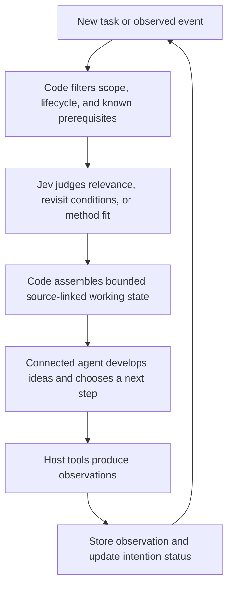

# Jev for continuity, planning, and an operational self-model

September 19, 2026 in Denver; September 20 UTC.

## The central use

Use Jev to help a connected agent maintain the right context, commitments, alternatives, and methods across time. The practical target is continuity of useful behavior. Typed judgments can help decide what deserves attention, where a record belongs, and whether an event makes a stored intention worth reconsidering.

The host supplies language, candidate ideas, explanations, and decisions. Code maintains record identity, scope, lifecycle, dependencies, budgets, and observed execution state. Jev supplies narrow semantic judgments where those exact rules are insufficient. An external record can improve functional continuity without making a claim about subjective experience.

## Six applications

**Prospective memory: intentions that know when to return.** A dormant idea carries a reason to revisit it: an instrument becomes accessible, a dependency clears, or evidence arrives. Code handles known IDs, timestamps, cancellation, and explicit dependencies. Jev handles the remaining semantic match between the revisit condition and an event, including paraphrase, negation, partial progress, and uncertainty. Resurfacing an intention does not execute it.

**Reconstruct working state for the next step.** Assemble a small state for the task actually being resumed. Include applicable constraints, unresolved commitments, necessary observations, and source references. Keep reusable concepts and procedures behind an index. The prototype ranks records independently, then copies selected source records exactly, preserving whether each is an observation, intention, constraint, hypothesis, or procedure. Pins and dependency closure are enforced in code; mandatory context exceeding the budget produces an overflow instead of silent loss.

**An operational self-model based on evidence.** Retain current user-directed commitments, actual tool access, attempts and outcomes, known gaps, and methods with their conditions of use. Jev can help surface the relevant part before a next step. Capability claims require probes or observed outcomes and can become stale when environments change. A confident biography written by the agent is insufficient. The fixtures include lost remote access, incomplete checks, and proposed actions never observed to complete; a longitudinal capability model has not yet been tested.

**Higher-order thought through transferable methods.** Retain the mechanism of a method, not only its conclusion: trace source lineage, isolate one variable, preserve acceptable alternatives, identify missing prerequisites, or clarify an uninterpretable result. Jev can compare a new problem with those methods across subject areas. The host develops the analogy and checks its assumptions. Type metadata and ordinary search already help substantially; the baseline audit below shows why they should precede Jev. Retrieving an existing method is not evidence of inventing a new concept.

**Plans as conditional commitments.** Represent a step with its preconditions, unresolved dependencies, intended observable outcome, and reconsideration conditions. An event can resurface affected steps. Before acting, a controller checks the current state version and real preconditions; a judgment predating a cancellation cannot be applied to the newer state. Afterwards, tool results establish attempts and observations. A persistent scheduler, action executor, and end-to-end plan controller remain proposed compositions of the tested components.

**Preserve alternative futures.** An exploration retains its assumptions, potential tests, objections, and revisit conditions after attention moves elsewhere. Jev may help bring it back when relevant. Git provides reproducible starting points and separately editable worktrees. Application metadata records parent scope and assumption lineage. Materialize worktrees for active explorations, rather than for every memory. Combining files must not turn branch assumptions into shared conclusions.

## Prototype flow

The implemented prototype covers eligibility, Jev judgments, bounded source-preserving selection, and recorded experiment output. It does not install native host hooks, replace the agent's context, execute actions, or modify the user's long-term memory store. An eventual MCP should expose explicit operations through the host's supported tools, with Jev called through OpenRouter by default.

## What was tested

The continuity study has 36 synthetic cases: 12 prospective reminders, 12 working-state selections, and 12 method-retrieval cases. Each function has six development and six evaluation cases, with original wording, paraphrase, and reversed order. Policy and labels were frozen before calls; no rubric revision or threshold fitting followed the results.

All **108 primary calls** returned valid responses and matched the predeclared success criterion. Subsets ran sequentially without tuning between them. These are same-author stress cases, not a blinded sample of real conversations. Repeated variants are not independent examples.

| Function | Jev evaluation | Initial lexical baseline | Stronger audit baseline |
| --- | ---: | ---: | ---: |
| Revisit an intention at the right event | 6/6 cases; 18/18 variants | 1/6 | Not evaluated |
| Retain designated records in a three-card state | 6/6 cases; 18/18 variants | 1/6 | Not evaluated |
| Retrieve a designated method in a two-card set | 6/6 cases; 18/18 variants | 0/6 | **5/6** after filtering non-procedure records in code |

The initial recency baseline matched 0/6 evaluation cases for both packet and method selection. Filtering record type improved method recency to 2/6. This audit was post hoc and is recorded separately; it does not replace frozen original reports.

The initially dramatic method comparison partly reflected an unnecessarily weak baseline: topical distractors were already labelled observations, so code could exclude them without inference. After that filter, Jev's difference was one case on this small set. This does not establish a large retrieval advantage over a well-designed search system.

Packet tests retained both designated consequential records. Incompatible scope and superseded-state exclusion are code behavior shared by all conditions, not model achievements. Selected record text occupied 949 of 2,234 eligible record characters in canonical evaluation packets: about **42% of source record text**, excluding metadata and archive references. This is not a measured token saving or downstream task-success result.

### Additional probes

**Memory crowding:** Four paraphrases of one observation were added to two packet cases. Coverage was scored by source identity, crediting aliases for the same information. Across 12 base/crowded variant calls, both normal packing and a one-representative-per-source cap retained all required source information. The source cap showed no accuracy gain in this probe; broader redundancy and concept-coverage tests remain open.

**Actual Git worktrees:** A disposable repository branched two incompatible assumptions from one commit and merged both branches cleanly. Both assumptions appeared in the merged files. Explicit scope filtering returned only the applicable branch assumption and neither as a shared conclusion. A clean Git merge does not resolve semantic disagreement. No project Git history was touched.

Across the primary study and crowding probe, **120 Jev calls** cost **$0.007477428** as reported by OpenRouter. All identified `typesafe/jev-1.13-20260917`. Median successful-call latency was about 202 ms in development and 212 ms in evaluation. No separate generative API calls were made. TypeSafe direct was not used live because its key was not inherited by this process.

## Evidence and reproduction

- [Development report](../studies/continuity/runs/2026-09-20T03-06-22.922Z-development-506e7462/report.md)
- [Evaluation report](../studies/continuity/runs/2026-09-20T03-06-36.352Z-evaluation-bc576913/report.md)
- [Frozen protocol](../studies/continuity/protocol.json)
- [Stronger method-baseline audit](../studies/continuity/type-aware-baselines.json)
- [Crowding probe](../studies/continuity/crowding/2026-09-20T03-08-47.183Z/summary.json)
- [Git worktree experiment](../studies/continuity/git-branch-demo.json)

`npm run continuity` prepares a development dry run using the latest alias. Add `-- --live --split development` for OpenRouter calls. Evaluation runs (dry or live) require a concrete model, for example `npm run continuity -- --split evaluation --model typesafe/jev-1.13-20260917`; add `--live` for inference. `--provider typesafe` selects the direct API with its own key and model slug. Floating evaluation aliases are refused before any files or requests are created. Results live under `studies/continuity/runs`, separate from the original inquiry study.

`npm run verify:continuity` checks saved requests, responses, fingerprints, source snapshots, packets, reported counts, and crowding coverage without inference. `npm run check` and `npm test` validate the code. `npm run verify:study` still verifies the original inquiry study.

Fixture, probe, and audit scripts remain under `scripts`. Fixed artifact writers refuse to overwrite evidence; exploratory runs create timestamped directories. The project imports no code or data from the wiki or other projects.

## Recommended next step

The highest-value product slice is an explicit memory preparation operation: given the current goal, an event, and a scope, return applicable commitments, changed assumptions, relevant methods, and source-linked records within a budget. The agent can request additional context when that budget is insufficient.

Before automatic use, replay real chronological work with independently assessed continuation tasks. Measure missed commitments, false reminders, repeated failed actions, stale assumptions, unhelpful context, retrieval cost, and actual completion. Compare typed lexical retrieval, a well-built summary, and the same agent without Jev. Include no-match cases, unfamiliar record types, longer histories, and overlapping scopes. These tests can establish whether the composition helps an agent continue effectively; the present component study cannot.

## Sources and inspiration

The user's bounded-structured-memory and markovian-carryover notes inspired layered storage and Established/Open/Heading handoffs. Their exact budgets and broad claims are treated as proposals, not established limits.

TypeSafe's [skill-suggestion cookbook](https://docs.typesafe.ai/cookbooks/skill_suggestion) demonstrates progressive context selection. [Composite scoring](https://docs.typesafe.ai/patterns/composite-scoring) supports independently useful dimensions with code-owned composition. [Entity alignment](https://docs.typesafe.ai/cookbooks/entity_alignment) suggests a future study of semantic duplicates beyond exact source identity. These examples motivate patterns; local performance figures come only from the recorded experiments.

[The Markovian Thinker](https://arxiv.org/html/2510.06557v3) studies bounded carryover in reasoning environments. It does not prove this external-memory prototype makes arbitrary conversations Markovian. [Git's documentation](https://git-scm.com/docs/git-worktree) defines the worktree behavior used in the synthetic experiment.
