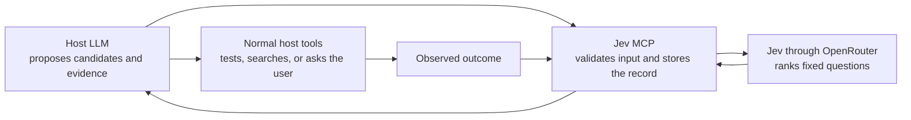

# Jev MCP v0: an evidence-gated decision spine

## Purpose

Build a local MCP server that helps an agent choose among a small set of
explicit candidate actions. The host LLM proposes options and gathers
evidence. Jev ranks the options against a fixed, versioned rubric. The MCP
stores the decision record and later attaches observed outcomes.

This is decision support. It does not decide what is true, declare an action
ethical, execute an action, or modify its own policy while it is running.

## Reference contracts

- [OpenRouter's Typesafe models](https://openrouter.ai/typesafe) currently
  describe Jev as a structured decision model for routing and classification.
  That makes it a plausible ranking component, but not an established value
  function for open-ended reasoning. We must measure whether its rankings
  predict better outcomes in the chosen use case.
- [The MCP tools specification](https://modelcontextprotocol.io/specification/2025-11-25/server/tools)
  defines schema-based tools and recommends validation, timeouts, and
  human-in-the-loop controls. The initial surface below follows those limits.

## The useful division of labour



| Component | May do | Must not do |
| --- | --- | --- |
| Host LLM | Generate alternatives, explain trade-offs, collect evidence, propose tests | Treat a Jev score as proof or execute sensitive action without the host's normal approval rules |
| Jev | Return typed answers to a fixed set of narrow, input-conditioned questions | Invent evidence, make a final decision, or set policy weights |
| MCP server | Validate schemas, call Jev, persist provenance, expose records | Silently expand a rubric, execute actions, or accept an unsupported score |
| External world | Produce test results, measurements, or user feedback | Be replaced by model self-evaluation |

## Repairing the current framework

The notes have three valuable ideas: distinct generation and evaluation,
explicit constraints, and a feedback loop. The following changes are needed
before they become a sound runtime.

| Draft idea | Problem | v0 replacement |
| --- | --- | --- |
| “Jev as the value function” | A scalar output is not calibrated simply because it is typed. | Call it a **candidate-ranking signal** until it beats a baseline on held-out decisions. |
| MCTS | There are no defined state transitions, rollouts, visit counts, or rewards. | Start with a bounded **beam of 2–8 alternatives**. Add search only after a discrete task domain and reward are demonstrated. |
| Markovian state tuple | A small state can omit assumptions, source provenance, and unresolved contradictions. | Use a versioned decision record with an auditable claim ledger. Treat it as a summary, not proof that history is irrelevant. |
| Ethical score | Ethics and harm are not safely reducible to one opaque probability. | Use declared hard constraints and normal host/user approval. Scores may identify a concern; they cannot waive a constraint. |
| LLM-generated questionnaires | Free-form rubrics make runs incomparable and allow prompt-derived policy drift. | Start with named, reviewed rubric versions. Add constrained rubric templates only after evaluation. |
| Online adaptation of weights | A few noisy or self-reported outcomes can create reward hacking. | Store outcomes first; update a policy only in an offline, versioned evaluation run. |

## v0 decision record

Each decision receives an immutable identifier. New information appends an
event; it does not overwrite the original proposal or score.

```json
{
  "decision_id": "dec_…",
  "created_at": "2026-09-19T…Z",
  "goal": "Choose the next implementation step",
  "constraints": ["do not send data externally", "finish in one day"],
  "claims": [
    {
      "id": "claim_1",
      "text": "The existing test suite can exercise this change.",
      "source": "local repository inspection",
      "status": "unverified",
      "confidence": 0.6
    }
  ],
  "candidates": [
    {"id": "A", "action": "Add a narrow integration test", "assumptions": ["claim_1"]}
  ],
  "rubric_version": "candidate-ranking-v1",
  "outcome_contract": {
    "prediction": "The selected option will complete the stated goal without a regression.",
    "evaluator": "test result and user review",
    "measure_by": "2026-09-20T…Z",
    "success_metric": "all specified tests pass and no reported regression"
  },
  "events": []
}
```

Confidence is a report of uncertainty, never a statement that a claim is
true. Claims need a source label, and a score cannot turn an unverified claim
into evidence.

## Initial rubric

Use a small fixed rubric that is meaningful for planning and implementation
decisions. Score every criterion independently and return `unknown` whenever
the supplied record does not support an answer.

| Signal | Question put to Jev | Use |
| --- | --- | --- |
| Goal contribution | “Given this record, how likely is this candidate to advance the stated goal?” | Ranking only |
| Feasibility | “Does the record contain a plausible path to complete this within the stated constraints?” | Ranking only |
| Evidence adequacy | “Are the important assumptions supported by cited evidence in this record?” | Triggers evidence gathering when low |
| Reversibility | “Can this candidate be undone without loss under the stated constraints?” | Prefers safer experiments |
| Dependency readiness | “Is a required dependency unresolved?” | A hard `blocked` flag when high |

Do not include novelty, character, moral worth, or a single “overall truth”
number in v0. Those terms are too underspecified to evaluate reliably.

The server computes a transparent rank from the accepted signals. It returns
both the individual answers and the formula inputs; it never returns only a
winning candidate.

## MCP surface

The first server should expose three tools and one read-only resource.

| Name | Purpose | Effect |
| --- | --- | --- |
| `decision.rank_candidates` | Validate a decision record, ask the v1 rubric, and return ranked candidates plus unknowns and blockers | Writes an append-only ranking event |
| `decision.record_outcome` | Attach an externally observed test result, measurement, or user judgment to an outcome contract | Writes an append-only outcome event |
| `decision.get_record` | Retrieve a decision and its provenance | Read-only |
| `decision://records/{id}` | Resource form of a single decision record | Read-only |

There is deliberately no `execute`, `adapt_weights`, `approve`, or
`declare_safe` tool. The MCP is not an authority over the host's permission
model. Every tool has strict JSON schemas, output schemas, size limits,
timeouts, and structured errors.

## The first loop

1. The host creates a decision record with 2–8 candidate next steps.
2. The server rejects records missing a goal, constraints, candidate IDs,
   evidence labels, or an outcome contract.
3. Jev evaluates the fixed rubric in batches.
4. The server returns the full ranked table, blockers, unknowns, rubric
   version, and a request fingerprint.
5. The host chooses whether to gather evidence, run a reversible test, ask
   the user, or abandon every candidate. It does not automatically execute.
6. A real result is recorded against the precommitted outcome contract.
7. Periodically, an offline evaluator compares Jev's ranking with a simple
   baseline such as original order or host-only ranking.

This expresses the useful Peircean loop: generate a hypothesis, derive a
testable prediction, and update from observation. It also lets the
meta-advancement framework govern *which question is next* without allowing
it to rewrite policy opportunistically.

## Outcome signal

There is no general “ground truth” scalar for every dilemma. Each decision
must declare its own observable outcome before ranking:

| Decision class | Outcome signal | Example |
| --- | --- | --- |
| Code change | Test or acceptance result, regression count, effort | Test suite passes and the requested behavior works |
| Research hypothesis | Prediction and predeclared measurement | Prediction matches a source, data set, or experiment |
| Planning | Completion, delay, cost, and user assessment | Chosen step unblocks the next milestone within the stated budget |
| Human-sensitive choice | Explicit human judgment and constraint compliance | No automatic action; the record helps the person review trade-offs |

Safety and consent are constraints, not reward terms to be traded against
speed or utility. An outcome must identify who or what evaluated it, when it
was observed, and whether it is objective, user-reported, or still unknown.

## Evaluation gates

Do not add search, adaptive weights, or dynamic rubrics until v0 clears these
gates on a stored decision set:

1. **Reliability:** the server rejects malformed inputs and provider output,
   and preserves the record on every failure.
2. **Ranking value:** Jev's top choices beat a simple baseline often enough
   to justify their cost for the selected domain.
3. **Calibration:** high-confidence rankings succeed more often than
   low-confidence rankings. If this is not true, hide confidence from policy.
4. **Diversity:** pruning does not repeatedly erase the only reversible or
   evidence-seeking option.
5. **Safety:** no score can bypass a constraint or a host approval boundary.

If the ranking fails to beat the baseline after a predefined number of
records, keep the audit data and stop expanding the system. That is a useful
negative result, not a reason to add more machinery.

## Build order

1. Create an OpenRouter transport spike using
   `~typesafe/jev-latest`, with fixed-schema response validation and
   fail-open behavior.
2. Implement the decision record and an append-only local store.
3. Implement `decision.rank_candidates` with the five v1 signals and mocked
   transport tests.
4. Add `decision.record_outcome` and a small manually labelled evaluation
   corpus from one real domain.
5. Run the gates above before adding stateful search or adaptation.

## Initial use case: structured conceptual inquiry

The product should begin with conceptual inquiry, not software-task planning.
It accepts a problem, surprise, or proposed principle; generates competing
hypotheses and next questions; records predictions and evidence; then carries
the best-supported state forward. This is the first implementation of the
Peircean and meta-advancement concepts in this repository.

Software-task planning remains useful as one early calibration harness because
its outcomes are cheap to observe. It is not the intended scope of the system.
The fuller architecture is in
[Jev MCP concept architecture](jev-mcp-concept-architecture.md).

The operative research question is not “how do we make Jev decide
everything?” It is “for which forms of inquiry does this architecture improve
the quality and speed of grounded discovery over an ordinary agent loop?”
